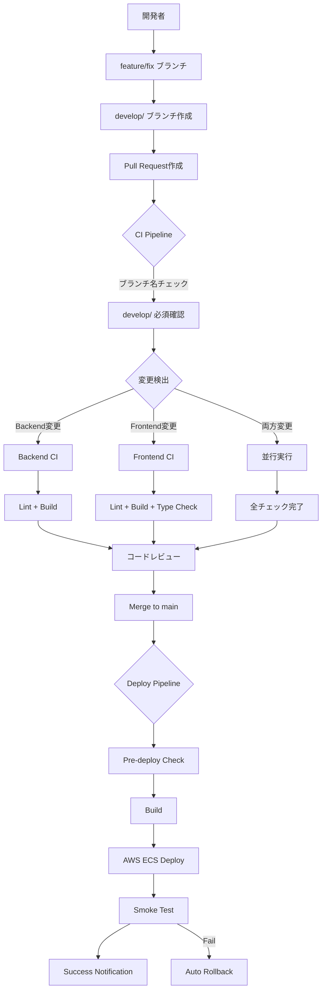
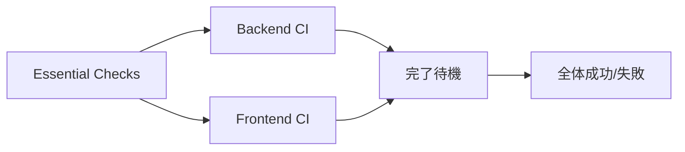

# CI/CD完全ガイド

## 📋 目次

1. [概要](#概要)
2. [ブランチ戦略とCI/CD](#ブランチ戦略とcicd)
3. [CI パイプライン詳細](#ci-パイプライン詳細)
4. [デプロイパイプライン詳細](#デプロイパイプライン詳細)
5. [セットアップ手順](#セットアップ手順)
6. [実際の使い方](#実際の使い方)
7. [トラブルシューティング](#トラブルシューティング)

---

## 概要

このプロジェクトでは、**効率的で安全な開発プロセス**を実現するために、**変更検出型CI**と**自動デプロイ**を組み合わせたシステムを導入しています。

### 🎯 目的

- **高速フィードバック**: Pull Request時の必要なチェックのみ実行（1-3分で完了）
- **効率性**: 変更されたコンポーネントのみをテスト
- **品質保証**: Lint・ビルドチェックで基本品質を担保
- **安全なデプロイ**: develop/ ブランチからのマージのみ許可
- **自動化**: mainブランチから本番環境への自動デプロイ

### 🏗️ アーキテクチャ概要



### 🎭 CI特徴

| 特徴 | 説明 | メリット |
|------|------|----------|
| **変更検出** | 変更されたコンポーネントのみ実行 | 高速化・効率性 |
| **並行実行** | Backend/Frontend を同時実行 | 時間短縮 |
| **ブランチ保護** | develop/ ブランチからのみマージ可能 | 安全性確保 |
| **自動デプロイ** | main ブランチから本番環境に自動デプロイ | 継続的デリバリー |

---

## ブランチ戦略とCI/CD

### 🌳 ブランチ構成

```
📦 Repository
├── 🔒 main (本番環境)
│   ├── 直接push禁止
│   ├── develop/ ブランチからのみマージ可能
│   └── 🚀 自動デプロイ → AWS ECS
│
├── 🔧 develop/feature-name (開発ブランチ)
│   ├── 🚀 自動CI実行
│   ├── 👥 コードレビュー必須
│   └── mainへのマージ可能
│
├── 🚀 feature/feature-name (機能開発)
├── 🐛 fix/bug-name (バグ修正)
└── 🔥 hotfix/urgent-fix (緊急修正)
```

### 🚫 制約ルール

| ブランチ | 直接Push | PR作成先 | ブランチ名制約 | CI実行 | レビュー |
|---------|---------|----------|---------------|--------|----------|
| `main` | ❌ 禁止 | - | - | ✅ 軽量 | ✅ 必須 |
| `develop/` | ✅ 可能 | `main` | develop/で開始 | ✅ 選択的 | ✅ 必須 |
| `feature/` | ✅ 可能 | `develop/`推奨 | - | ✅ 選択的 | 任意 |

---

## CI パイプライン詳細

### 📊 実行タイミング

```yaml
# 自動実行: Pull Request時
on:
  pull_request:
    branches: [main, "develop/**"]
    types: [opened, synchronize, reopened]

# 自動実行: Push時  
on:
  push:
    branches: [main]
```

### 🏗️ パイプライン構成

## CI Pipeline（自動実行）

### 1️⃣ **Essential Checks** (必須チェック)

```bash
実行条件: 全てのPull Request・Push
実行時間: ~30秒
```

**チェック内容:**

#### ブランチ名チェック（mainへのPRのみ）
```bash
if [[ ! "$BRANCH_NAME" =~ ^develop/.+ ]]; then
  echo "❌ Error: Pull requests to main branch must come from 'develop/' branches"
  exit 1
fi
```

**成功例:**
```
✅ develop/user-authentication
✅ develop/fix-login-bug  
✅ develop/add-payment-system
```

**失敗例:**
```
❌ feature/user-auth      → develop/user-auth に変更が必要
❌ bugfix/login-issue     → develop/fix-login-issue に変更が必要
❌ user-authentication   → develop/user-authentication に変更が必要
```

#### 変更ファイル検出
```yaml
filters:
  backend:
    - 'backend/**'
    - 'api/**'
    - 'database/**'
    - 'go.mod'
    - 'go.sum'
  frontend:
    - 'frontend/**'
    - 'package*.json'
  infrastructure:
    - 'infrastructure/**'
    - 'docker-compose.yml'
    - 'Dockerfile*'
    - '.github/workflows/**'
```

### 2️⃣ **Backend CI** (backend変更時のみ)

```bash
実行条件: backend/**, api/**, database/** の変更時
実行時間: ~1-2分
並行実行: Frontend CI と同時実行可能
```

**実行環境:**
- Go 1.24
- Ubuntu Latest
- Go modules キャッシュ使用

**実行内容:**

1. **依存関係インストール**
```bash
go mod download
```

2. **Linting**
```bash
go install github.com/golangci/golangci-lint/cmd/golangci-lint@latest
golangci-lint run --timeout=5m
```

3. **ビルドチェック**
```bash
go build -o app ./cmd/main.go
```

**品質基準:**
- ✅ golangci-lint エラー: 0個（必須）
- ✅ ビルド: 成功（必須）

### 3️⃣ **Frontend CI** (frontend変更時のみ)

```bash
実行条件: frontend/**, package*.json の変更時
実行時間: ~1-2分
並行実行: Backend CI と同時実行可能
```

**実行環境:**
- Node.js 18
- Ubuntu Latest
- npm キャッシュ使用

**実行内容:**

1. **依存関係インストール**
```bash
npm ci --prefer-offline --no-audit
```

2. **ESLint**
```bash
npm run lint
```

3. **TypeScript型チェック**
```bash
npm run type-check
```

4. **ビルドチェック**
```bash
npm run build
```

**品質基準:**
- ✅ ESLint エラー: 0個（必須）
- ✅ TypeScript エラー: 0個（必須）
- ✅ ビルド: 成功（必須）

### 🚀 同時変更時の動作

Backend・Frontend の**両方**が変更された場合：



- **並行実行**: Backend CI と Frontend CI が同時実行
- **実行時間**: 最も遅いジョブに依存（通常1-2分）
- **成功条件**: 両方のジョブが成功

---

## デプロイパイプライン詳細

### 📊 実行タイミング

```yaml
on:
  push:
    branches: [main]
  workflow_dispatch: # 手動実行も可能
```

### 🏗️ デプロイフロー

### 1️⃣ **Pre-deploy Checks**

```bash
実行時間: ~30秒
```

**チェック内容:**

1. **develop/ブランチからのマージ確認**
```bash
LAST_COMMIT_MESSAGE=$(git log -1 --pretty=format:"%s")
if [[ "$LAST_COMMIT_MESSAGE" =~ ^Merge\ pull\ request.*develop/.* ]]; then
  echo "✅ Deploy from develop/ branch merge confirmed"
else
  echo "⚠️  Warning: Deploy not from develop/ branch merge"
fi
```

2. **API破壊的変更チェック**
```bash
if git diff HEAD~1 --name-only | grep -E "(api/|openapi\.yml)"; then
  echo "⚠️  API changes detected - ensure backward compatibility"
fi
```

### 2️⃣ **Build**

```bash
実行時間: ~2-3分
```

**実行内容:**

1. **Frontend 本番ビルド**
```bash
NODE_ENV=production npm run build
```

2. **Backend 本番ビルド**
```bash
CGO_ENABLED=0 GOOS=linux go build -a -installsuffix cgo -o main ./cmd/main.go
```

3. **ビルドアーティファクト保存**
```yaml
artifacts:
  - frontend/.next/
  - backend/main
retention-days: 30
```

### 3️⃣ **Deploy to AWS**

```bash
実行時間: ~3-5分
環境: production
```

**デプロイ手順:**

1. **Docker イメージビルド**
```bash
# Backend image
docker build -t $ECR_REGISTRY/app-template-backend:$GITHUB_SHA -f backend/Dockerfile .

# Frontend image  
docker build -t $ECR_REGISTRY/app-template-frontend:$GITHUB_SHA -f frontend/Dockerfile .
```

2. **ECR プッシュ**
```bash
aws ecr get-login-password | docker login --username AWS --password-stdin $ECR_REGISTRY
docker push $ECR_REGISTRY/app-template-backend:$GITHUB_SHA
docker push $ECR_REGISTRY/app-template-frontend:$GITHUB_SHA
```

3. **ECS サービス更新**
```bash
aws ecs update-service \
  --cluster $ECS_CLUSTER_NAME \
  --service $ECS_SERVICE_NAME \
  --force-new-deployment

aws ecs wait services-stable \
  --cluster $ECS_CLUSTER_NAME \
  --services $ECS_SERVICE_NAME
```

### 4️⃣ **Smoke Tests**

```bash
実行時間: ~30秒
```

**テスト内容:**
```bash
# ヘルスチェック
curl -f "$PRODUCTION_URL/health"

# 基本的なエンドポイントチェック
curl -f "$PRODUCTION_URL"
```

### 5️⃣ **通知・ロールバック**

**成功時:**
```bash
curl -X POST -H 'Content-type: application/json' \
  --data '{"text":"🚀 Production deployment completed"}' \
  $SLACK_WEBHOOK_URL
```

**失敗時（自動ロールバック）:**
```bash
aws ecs update-service \
  --cluster $ECS_CLUSTER_NAME \
  --service $ECS_SERVICE_NAME \
  --task-definition $PREVIOUS_TASK_DEFINITION

curl -X POST -H 'Content-type: application/json' \
  --data '{"text":"⚠️ Emergency rollback executed"}' \
  $SLACK_WEBHOOK_URL
```

---

## セットアップ手順

### 1. GitHub Secrets 設定

以下のシークレットをGitHub リポジトリに設定：

```bash
# AWS関連
AWS_ACCESS_KEY_ID=AKIA...
AWS_SECRET_ACCESS_KEY=...
AWS_REGION=ap-northeast-1
ECR_REGISTRY=123456789012.dkr.ecr.ap-northeast-1.amazonaws.com

# ECS関連
ECS_CLUSTER_NAME=app-template-cluster
ECS_SERVICE_NAME=app-template-service
PREVIOUS_TASK_DEFINITION=app-template:1

# 通知・監視
PRODUCTION_URL=https://your-app.com
SLACK_WEBHOOK_URL=https://hooks.slack.com/services/...
```

### 2. ブランチ保護設定

**main ブランチ:**
```yaml
protection_rules:
  required_status_checks:
    - "Essential Checks"
    - "Backend Lint" (if backend changed)
    - "Backend Build" (if backend changed)  
    - "Frontend Lint" (if frontend changed)
    - "Frontend Build" (if frontend changed)
  enforce_admins: true
  required_pull_request_reviews:
    required_approving_review_count: 1
  restrictions:
    branches: ["develop/**"]
```

### 3. AWS インフラ設定

**必要なAWSリソース:**
- ECR Repository (backend/frontend用)
- ECS Cluster
- ECS Service
- ECS Task Definition
- IAM Role (GitHub Actions用)

**IAM権限例:**
```json
{
  "Version": "2012-10-17",
  "Statement": [
    {
      "Effect": "Allow",
      "Action": [
        "ecr:GetAuthorizationToken",
        "ecr:BatchCheckLayerAvailability",
        "ecr:BatchGetImage",
        "ecr:GetDownloadUrlForLayer",
        "ecr:PutImage",
        "ecr:InitiateLayerUpload",
        "ecr:UploadLayerPart",
        "ecr:CompleteLayerUpload"
      ],
      "Resource": "*"
    },
    {
      "Effect": "Allow",
      "Action": [
        "ecs:UpdateService",
        "ecs:DescribeServices"
      ],
      "Resource": "*"
    }
  ]
}
```

---

## 実際の使い方

### 🚀 新機能開発フロー

#### 1. ブランチ作成
```bash
# ✅ 正しい命名
git checkout -b develop/user-authentication
git checkout -b develop/fix-login-bug
git checkout -b develop/add-payment-feature

# ❌ 間違った命名（mainへのPRが拒否される）
git checkout -b feature/user-auth
git checkout -b bugfix/login
```

#### 2. 開発・テスト
```bash
# ローカル開発
make dev

# ローカルでのLint・テスト（CI前確認）
make lint
make test
make build
```

#### 3. Pull Request作成
```bash
git push origin develop/user-authentication
# GitHub UI でPR作成（main または develop/other-branch に）
```

#### 4. CI自動実行
- **変更検出**: 変更されたコンポーネントを自動検出
- **並行実行**: 必要なチェックのみ並行実行
- **高速フィードバック**: 1-3分で結果通知

### 🔄 CI結果の確認

#### 成功例
```
✅ Essential Checks - ブランチ名OK、変更検出完了
✅ Backend Lint - golangci-lint passed
✅ Backend Build - build successful  
✅ Frontend Lint - ESLint passed
✅ Frontend Build - build successful
```

#### 失敗例とその対処
```
❌ Backend Lint - golangci-lint failed
→ cd backend && golangci-lint run で確認・修正

❌ Frontend Build - TypeScript error
→ cd frontend && npm run type-check で確認・修正

❌ Branch Protection - develop/ required
→ ブランチ名を develop/feature-name に変更
```

### 🚀 デプロイフロー

#### 1. mainブランチマージ
```bash
# PR承認後、mainブランチにマージ
# 自動でデプロイパイプライン開始
```

#### 2. デプロイ監視
- GitHub Actions でデプロイ進行状況確認
- Slack で通知受信
- 本番環境での動作確認

#### 3. 失敗時の対応
- 自動ロールバック実行
- Slack でアラート受信
- 手動での詳細確認・修正

---

## トラブルシューティング

### CI失敗時の対処

#### Backend Lint エラー
```bash
# エラー確認
cd backend
golangci-lint run

# よくあるエラーと対処
# 1. import 順序
go fmt ./...

# 2. unused variable
# 使用していない変数を削除

# 3. naming convention
# Go命名規則に従って修正
```

#### Frontend エラー
```bash
# Lint エラー確認
cd frontend
npm run lint

# Type エラー確認  
npm run type-check

# よくあるエラーと対処
# 1. ESLint エラー
npm run lint -- --fix

# 2. TypeScript エラー
# 型定義を追加・修正

# 3. Build エラー
npm run build
```

#### ブランチ名エラー
```bash
# 現在のブランチ名確認
git branch --show-current

# ブランチ名変更
git branch -m develop/feature-name

# または新しいブランチ作成
git checkout -b develop/feature-name
git cherry-pick commit-hash
```

### デプロイ失敗時の対処

#### AWS認証エラー
```bash
# Secrets確認
# - AWS_ACCESS_KEY_ID
# - AWS_SECRET_ACCESS_KEY  
# - AWS_REGION

# IAM権限確認
# ECR, ECS への適切な権限があるか確認
```

#### ECR プッシュ失敗
```bash
# ECRリポジトリ存在確認
aws ecr describe-repositories --repository-names app-template-backend

# 認証確認
aws ecr get-login-password --region ap-northeast-1 | docker login --username AWS --password-stdin $ECR_REGISTRY
```

#### ECS デプロイ失敗
```bash
# サービス状態確認
aws ecs describe-services --cluster $ECS_CLUSTER_NAME --services $ECS_SERVICE_NAME

# タスク定義確認
aws ecs describe-task-definition --task-definition app-template

# リソース不足確認
# CPU/Memory の使用量確認
```

### よくある問題と解決法

#### 1. CI が実行されない
**原因:** ブランチ名が実行条件に合わない
**解決:** 
- main, develop/** ブランチで実行される
- PR は main または develop/** 向けで実行される

#### 2. 一部のチェックのみ実行される
**原因:** 変更検出により、変更されたコンポーネントのみ実行
**解決:** 
- これは正常動作
- 全てのチェックを実行したい場合は空コミットで強制実行

#### 3. デプロイが実行されない
**原因:** main ブランチへのpushがない
**解決:**
- develop/ ブランチから main への PR をマージ
- または手動実行 (workflow_dispatch)

#### 4. ロールバックが失敗する
**原因:** PREVIOUS_TASK_DEFINITION が不正
**解決:**
- 有効なタスク定義ARNを設定
- ECS コンソールで前のリビジョンを確認

---

このガイドに記載されていない問題が発生した場合は、GitHub Issues または Slack で相談してください。