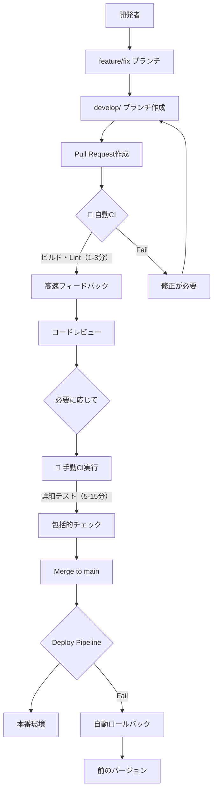

# CI/CD完全ガイド

## 📋 目次

1. [概要](#概要)
2. [ブランチ戦略とCI/CD](#ブランチ戦略とcicd)
3. [CI パイプライン詳細](#ci-パイプライン詳細)
4. [デプロイパイプライン詳細](#デプロイパイプライン詳細)
5. [ブランチ保護設定](#ブランチ保護設定)
6. [セットアップ手順](#セットアップ手順)
7. [実際の使い方](#実際の使い方)
8. [トラブルシューティング](#トラブルシューティング)
9. [ベストプラクティス](#ベストプラクティス)

---

## 概要

このプロジェクトでは、**安全で効率的な開発プロセス**を実現するために、**軽量な自動CI**と**包括的な手動CI**を組み合わせたシステムを導入しています。

### 🎯 目的

- **高速フィードバック**: Pull Request時の基本チェック（ビルド・Lint）を1-3分で完了
- **品質保証**: 必要に応じて実行できる包括的なテストスイート
- **柔軟性**: 開発段階に応じて適切なレベルのテストを選択可能
- **セキュリティ**: 脆弱性の早期発見と対処（手動実行）
- **安全なデプロイ**: main ブランチから本番環境への自動デプロイ

### 🏗️ アーキテクチャ概要



### 🎭 CI実行方式の比較

| 実行方式 | タイミング | 所要時間 | チェック内容 | 目的 |
|---------|-----------|----------|-------------|------|
| **🚀 自動CI** | PR作成・更新時 | 1-3分 | ビルド・Lint | 高速フィードバック |
| **🔧 手動CI** | 必要に応じて | 5-15分 | 詳細テスト・セキュリティ | 包括的品質保証 |

---

## ブランチ戦略とCI/CD

### 🌳 ブランチ構成

```
📦 Repository
├── 🔒 main (本番環境) - 直接push禁止
│   ↑ develop/feature-name からのみマージ可能
│   └── 🤖 自動デプロイ → 本番環境
│
├── 🔧 develop/feature-name (開発ブランチ)
│   ├── 🚀 自動CI (軽量・高速)
│   ├── 🔧 手動CI (詳細・包括的)
│   └── 👥 コードレビュー必須
│
├── 🚀 feature/feature-name (機能開発)
├── 🐛 fix/bug-name (バグ修正)
└── 🔥 hotfix/urgent-fix (緊急修正)
```

### 🚫 制約ルール

| ブランチ | 直接Push | PR作成 | 自動CI | 手動CI | レビュー必須 |
|---------|---------|---------|--------|--------|------------|
| `main` | ❌ 禁止 | `develop/`のみ | ✅ 軽量 | 🔧 利用可能 | ✅ 必須 |
| `develop/` | ✅ 可能 | ✅ 可能 | ✅ 軽量 | 🔧 利用可能 | ✅ 必須 |
| `feature/` | ✅ 可能 | ✅ 可能 | ✅ 軽量 | 🔧 利用可能 | 任意 |

---

## CI パイプライン詳細

### 📊 実行タイミング

```yaml
# 🚀 自動実行: Pull Request時
triggers:
  - opened      # PR作成時
  - synchronize # 新しいコミット時  
  - reopened    # PR再オープン時

# 🚀 自動実行: Push時  
triggers:
  - develop/**  # develop系ブランチ
  - feature/**  # feature系ブランチ
  - fix/**      # fix系ブランチ
  - hotfix/**   # hotfix系ブランチ

# 🔧 手動実行
triggers:
  - workflow_dispatch  # GitHub Actions UI から実行
```

### 🏗️ パイプライン構成

## 🚀 自動実行パイプライン（軽量・高速）

#### 1️⃣ **ブランチ保護チェック** (branch-protection)

```bash
実行条件: Pull Request to main
実行時間: ~30秒
実行方式: 🚀 自動
```

**チェック内容:**
- ブランチ名が `develop/` で始まるかチェック
- 命名規則の検証

**成功例:**
```
✅ develop/user-authentication
✅ develop/fix-login-bug  
✅ develop/add-payment-system
```

**失敗例:**
```
❌ feature/user-auth      → develop/user-auth に変更が必要
❌ bugfix/login-issue     → develop/fix-login-issue に変更が必要
❌ user-authentication   → develop/user-authentication に変更が必要
```

#### 2️⃣ **変更ファイル検出** (detect-changes)

```bash
実行条件: 全てのPull Request
実行時間: ~15秒
実行方式: 🚀 自動
```

**検出パターン:**

| カテゴリ | ファイルパターン | 影響するジョブ |
|---------|-----------------|--------------|
| **Backend** | `backend/**`, `api/**`, `database/**` | build-backend |
| **Frontend** | `frontend/**`, `package*.json` | build-frontend |
| **Infrastructure** | `infrastructure/**`, `docker-compose.yml` | - |

#### 3️⃣ **バックエンドビルド&Lint** (build-backend)

```bash
実行条件: backend/**, api/**, database/** の変更時
実行時間: ~1-2分
実行方式: 🚀 自動
```

**実行内容:**
1. **Go環境セットアップ** (Go 1.24)
2. **依存関係キャッシュ** (Go modules)
3. **依存関係インストール** (`go mod download`)
4. **ビルドチェック**
   ```bash
   echo "🔨 Building Go application..."
   go build -o app ./cmd/main.go
   echo "✅ Build successful"
   ```
5. **Linting実行**
   ```bash
   echo "🔍 Running Go linting..."
   golangci-lint run --timeout=5m
   echo "✅ Linting passed"
   ```

**品質基準:**
- ✅ ビルド: 成功（必須）
- ✅ Lintエラー: 0個（必須）

#### 4️⃣ **フロントエンドビルド&Lint** (build-frontend)

```bash
実行条件: frontend/**, package*.json の変更時
実行時間: ~1-2分
実行方式: 🚀 自動
```

**実行内容:**
1. **Node.js環境セットアップ** (Node.js 18)
2. **依存関係キャッシュ** (npm cache)
3. **依存関係インストール**
   ```bash
   echo "📦 Installing dependencies..."
   npm ci --prefer-offline --no-audit
   ```
4. **ESLint実行**
   ```bash
   echo "🔍 Running ESLint..."
   npm run lint
   echo "✅ ESLint passed"
   ```
5. **TypeScript型チェック**
   ```bash
   echo "🔍 Running TypeScript type check..."
   npm run type-check
   echo "✅ Type check passed"
   ```
6. **ビルド実行**
   ```bash
   echo "🔨 Building Next.js application..."
   npm run build
   echo "✅ Build successful"
   ```

**品質基準:**
- ✅ ESLintエラー: 0個（必須）
- ✅ TypeScriptエラー: 0個（必須）
- ✅ ビルド: 成功（必須）

#### 5️⃣ **PR要約コメント** (pr-summary)

```bash
実行条件: Pull Request時（最後に実行）
実行時間: ~30秒
実行方式: 🚀 自動
```

**コメント例:**
```markdown
## 🚀 自動CI結果 (基本チェック)

| Check | Status |
|-------|--------|
| Branch Protection | ✅ Passed |
| Backend Build & Lint | ✅ success |
| Frontend Build & Lint | ✅ success |

**Branch:** `develop/user-authentication` → `main`
**Commit:** abc123def456

---

💡 **手動実行が必要な追加テスト:**
- 🧪 Unit Tests (Backend/Frontend)
- 🔒 Security Scan
- 🔄 Integration Tests

手動実行は GitHub Actions の「Run workflow」ボタンから実行してください。
```

---

## 🔧 手動実行パイプライン（詳細・包括的）

#### 1️⃣ **バックエンド詳細テスト** (test-backend)

```bash
実行条件: 手動実行時のみ
実行時間: ~5-10分
実行方式: 🔧 手動
```

**テスト環境:**
```yaml
サービス:
  - MySQL 8.0 (ポート: 3306)
  - Redis 7-alpine (ポート: 6379)
```

**実行内容:**
1. **Go環境セットアップ** (Go 1.24)
2. **依存関係キャッシュ** (Go modules)
3. **依存関係インストール** (`go mod download`)
4. **テストファイル検出と実行** (テストファイルがある場合のみ)
   ```bash
   # テストファイルが存在する場合
   if find . -name "*_test.go" -type f | grep -q .; then
     echo "✅ Test files found, running tests..."
     go test -v -race -coverprofile=coverage.out ./...
     go tool cover -html=coverage.out -o coverage.html
   else
     echo "⏭️ No test files found, skipping tests..."
   fi
   ```
5. **カバレッジアップロード** (テストが実行された場合のみ)

**品質基準:**
- ✅ テスト: 全テストパス（テストファイルがある場合）
- ✅ カバレッジ: テストファイルがある場合のみレポート生成
- ✅ レースコンディション: テスト実行時のみチェック

#### 2️⃣ **フロントエンド詳細テスト** (test-frontend)

```bash
実行条件: 手動実行時のみ
実行時間: ~3-8分
実行方式: 🔧 手動
```

**実行内容:**
1. **Node.js環境セットアップ** (Node.js 18)
2. **依存関係キャッシュ** (npm cache)
3. **依存関係インストール**
   ```bash
   npm ci --prefer-offline --no-audit
   ```
4. **テストファイル検出と実行** (テストファイルがある場合のみ)
   ```bash
   # テストファイルが存在する場合
   if find . -name "*.test.*" -o -name "*.spec.*" | grep -q .; then
     echo "✅ Test files found, running tests..."
     npm run test -- --coverage --watchAll=false
   else
     echo "⏭️ No test files found, skipping tests..."
   fi
   ```
5. **ビルド成果物アップロード** (7日間保持)

**品質基準:**
- ✅ テスト: 全テストパス（テストファイルがある場合）
- ✅ カバレッジ: テストファイルがある場合のみレポート生成

#### 3️⃣ **セキュリティスキャン** (security-scan)

```bash
実行条件: 手動実行時のみ
実行時間: ~2-5分
実行方式: 🔧 手動
```

**スキャン内容:**
1. **Trivy脆弱性スキャン**
   - ファイルシステム全体をスキャン
   - 依存関係の脆弱性チェック
   - SARIF形式でレポート生成

2. **結果のアップロード**
   - GitHub Security tabに結果表示
   - 重要度別の脆弱性リスト

**セキュリティレベル:**
```
🔴 Critical: 即座に修正必要
🟠 High: 優先的に修正
🟡 Medium: 計画的に修正
🔵 Low: 適宜修正
```

#### 4️⃣ **統合テスト** (integration-test)

```bash
実行条件: 手動実行時のみ
実行時間: ~10-15分
実行方式: 🔧 手動
```

**テスト環境:**
```yaml
環境構成:
  - MySQL: app_template_test データベース
  - Redis: キャッシュサーバー
  - Backend: Go APIサーバー (ポート: 8080)
  - Frontend: Next.js アプリ (ポート: 3000)
```

**実行フロー:**
1. **環境変数設定**
   ```bash
   DB_HOST=mysql
   DB_USER=app_user
   DB_PASSWORD=app_password
   JWT_SECRET=test_jwt_secret_key_for_ci
   ```

2. **Docker Compose起動**
   ```bash
   echo "🔄 Starting integration tests..."
   docker-compose up -d --build
   ```

3. **サービス待機**
   ```bash
   # APIサーバーの起動を待機
   echo "⏳ Waiting for services to start..."
   timeout 60 bash -c 'until curl -f http://localhost:8080/health; do sleep 2; done'
   
   # フロントエンドの起動を待機
   timeout 60 bash -c 'until curl -f http://localhost:3000; do sleep 2; done'
   ```

4. **基本接続テスト**
   ```bash
   # 基本的な接続確認（テスト代替）
   curl -f http://localhost:8080/health || echo "⚠️ Backend health check failed"
   curl -f http://localhost:3000 || echo "⚠️ Frontend health check failed"
   
   echo "✅ Integration test completed - services are accessible"
   ```

5. **環境クリーンアップ**
   ```bash
   docker-compose down -v
   ```

---

## デプロイパイプライン詳細

### 🚀 実行タイミング

```yaml
triggers:
  push:
    branches: [main]    # mainブランチへのマージ時
  workflow_dispatch:    # 手動実行
```

### 🏗️ デプロイフロー

#### 1️⃣ **デプロイ前最終チェック** (pre-deploy-checks)

```bash
実行時間: ~1-2分
```

**チェック内容:**
1. **マージ元ブランチ確認**
   ```bash
   # 最新コミットがdevelop/からのマージかチェック
   LAST_COMMIT_MESSAGE=$(git log -1 --pretty=format:"%s")
   if [[ "$LAST_COMMIT_MESSAGE" =~ ^Merge\ pull\ request.*develop/.* ]]; then
     echo "✅ Deploy from develop/ branch merge confirmed"
   fi
   ```

2. **破壊的変更の検出**
   ```bash
   # APIスキーマの変更をチェック
   if git diff HEAD~1 --name-only | grep -E "(api/|openapi\.yml)"; then
     echo "⚠️ API changes detected - ensure backward compatibility"
   fi
   ```

#### 2️⃣ **本番ビルド** (build-and-test)

```bash
実行時間: ~5-10分
```

**ビルド内容:**
1. **フロントエンド本番ビルド**
   ```bash
   NODE_ENV=production npm run build
   ```

2. **バックエンド本番ビルド**
   ```bash
   CGO_ENABLED=0 GOOS=linux go build -a -installsuffix cgo -o main ./cmd/main.go
   ```

3. **成果物アップロード** (30日間保持)

#### 3️⃣ **セキュリティチェック** (security-check)

```bash
実行時間: ~3-5分
```

**チェック内容:**
1. **依存関係脆弱性スキャン**
   ```bash
   # Go dependencies
   govulncheck ./...
   
   # Node.js dependencies  
   npm audit --audit-level moderate
   ```

2. **シークレットスキャン**
   ```bash
   # 機密情報の漏洩チェック
   trufflehog --path ./
   ```

#### 4️⃣ **デプロイ実行** (deploy)

```bash
実行時間: ~5-10分
```

**デプロイフロー:**
1. **Dockerイメージビルド&プッシュ**
2. **ECSサービス更新**
3. **デプロイメント完了待機**
4. **スモークテスト実行**
5. **デプロイメント記録**

#### 5️⃣ **失敗時ロールバック** (rollback)

```bash
実行条件: deploy失敗時
実行時間: ~2-5分
```

**ロールバック内容:**
- 前のバージョンへの自動復元
- 緊急通知の送信

---

## 手動CI実行方法

### 🖱️ GitHub Actions UIから実行

1. **GitHubリポジトリページに移動**
2. **「Actions」タブをクリック**
3. **「CI Pipeline」ワークフローを選択**
4. **「Run workflow」ボタンをクリック**
5. **ブランチを選択して「Run workflow」実行**

### 💻 GitHub CLIから実行

```bash
# 現在のブランチで手動CI実行
gh workflow run ci.yml

# 特定のブランチで手動CI実行
gh workflow run ci.yml --ref develop/feature-name
```

### 📱 実行タイミングの推奨

| 開発段階 | 自動CI | 手動CI | 推奨タイミング |
|---------|--------|--------|--------------|
| **開発初期** | ✅ 実行 | ❌ 不要 | PR作成時の基本チェックで十分 |
| **機能完成** | ✅ 実行 | ✅ 推奨 | ユニットテスト・統合テスト実行 |
| **レビュー前** | ✅ 実行 | ✅ 必須 | 全てのテストパス確認 |
| **マージ前** | ✅ 実行 | ✅ 必須 | セキュリティスキャン含む全チェック |

---

## 実際の使い方

### 📝 典型的な開発フロー

#### 1. **機能開発開始**
```bash
# developブランチから新機能ブランチ作成
git checkout develop
git pull origin develop
git checkout -b develop/user-authentication
```

#### 2. **初期実装とPR作成**
```bash
# 初期実装
git add .
git commit -m "Add user authentication basic structure"
git push origin develop/user-authentication

# PR作成 → 🚀 自動CI実行（1-3分）
```

**自動CI結果例:**
```
✅ Branch Protection: Passed
✅ Backend Build & Lint: success  
✅ Frontend Build & Lint: success
```

#### 3. **機能完成後の詳細テスト**
```bash
# GitHub Actions UI で手動実行
# または
gh workflow run ci.yml --ref develop/user-authentication
```

**手動CI結果例:**
```
✅ Backend Tests: 15/15 passed (95% coverage)
✅ Frontend Tests: 8/8 passed  
✅ Security Scan: No vulnerabilities found
✅ Integration Tests: All services accessible
```

#### 4. **コードレビューとマージ**
- レビュアーが手動CIの結果を確認
- コードレビュー実施
- mainブランチへマージ
- 自動デプロイ実行

### 🎯 各段階での判断基準

#### **自動CI失敗時**
```
❌ Backend Build & Lint: failed
```
→ **即座に修正必要**（基本的なビルドエラー・Lintエラー）

#### **手動CI失敗時**
```
❌ Backend Tests: 12/15 passed
⚠️ Security Scan: 2 medium vulnerabilities found
```
→ **修正を検討**（テスト失敗・脆弱性は重要度により判断）

### 🔄 継続的改善

#### **テストファイルの追加**
- テストファイルを追加すると、自動的にテスト実行対象に
- `*_test.go` (Go) や `*.test.*`, `*.spec.*` (JavaScript/TypeScript)

#### **新しいチェックの追加**
- 手動CIに新しいチェックを追加可能
- 自動CIは軽量性を保つため、基本的なチェックのみ

---

## ブランチ保護設定

### 🛡️ Protection Rules

#### **main ブランチ**
```yaml
Protection Settings:
  - Direct push: ❌ Disabled
  - Pull request required: ✅ Enabled
  - Required status checks:
    - branch-protection ✅
    - build-backend ✅  
    - build-frontend ✅
  - Require branches to be up to date: ✅ Enabled
  - Require code owner reviews: ✅ Enabled
  - Dismiss stale reviews: ✅ Enabled
  - Require conversation resolution: ✅ Enabled
```

#### **develop ブランチ**
```yaml
Protection Settings:
  - Direct push: ✅ Allowed
  - Pull request required: ✅ Enabled (推奨)
  - Required status checks:
    - build-backend ✅
    - build-frontend ✅
  - Require branches to be up to date: ✅ Enabled
```

---

## セットアップ手順

### 🚀 初回セットアップ

#### 1. **リポジトリ設定**
```bash
# リポジトリクローン
git clone <repository-url>
cd app-template

# 開発ブランチ作成
git checkout -b develop
git push origin develop
```

#### 2. **GitHub Secrets設定**
```bash
# AWS関連
AWS_ACCESS_KEY_ID=your_access_key
AWS_SECRET_ACCESS_KEY=your_secret_key
AWS_REGION=ap-northeast-1
ECR_REGISTRY=123456789.dkr.ecr.ap-northeast-1.amazonaws.com

# ECS関連
ECS_CLUSTER_NAME=app-template-cluster
ECS_SERVICE_NAME=app-template-service

# 通知関連
SLACK_WEBHOOK_URL=https://hooks.slack.com/services/...
PRODUCTION_URL=https://your-app.com
```

#### 3. **ブランチ保護ルール設定**
```bash
# ブランチ保護設定の実行
gh workflow run branch-protection.yml
```

#### 4. **初回テスト実行**
```bash
# 自動CI確認用のPR作成
git checkout -b develop/setup-test
echo "# Setup Test" >> README.md
git add README.md
git commit -m "Add setup test"
git push origin develop/setup-test

# PR作成（自動CIが実行される）
gh pr create --title "Setup Test" --body "Testing CI setup"
```

### 🔧 ローカル開発環境

#### **Go環境**
```bash
# Go 1.24インストール確認
go version

# 依存関係インストール
cd backend
go mod download

# ローカルビルドテスト
go build -o app ./cmd/main.go

# Linting
go install github.com/golangci/golangci-lint/cmd/golangci-lint@latest
golangci-lint run
```

#### **Node.js環境**
```bash
# Node.js 18インストール確認
node --version

# 依存関係インストール
cd frontend
npm ci

# ローカルビルドテスト
npm run build

# Linting
npm run lint
npm run type-check
```

---

## 手動CI実行方法

### 🖱️ GitHub Actions UIから実行

1. **GitHubリポジトリページに移動**
2. **「Actions」タブをクリック**
3. **「CI Pipeline」ワークフローを選択**
4. **「Run workflow」ボタンをクリック**
5. **ブランチを選択して「Run workflow」実行**

### 💻 GitHub CLIから実行

```bash
# 現在のブランチで手動CI実行
gh workflow run ci.yml

# 特定のブランチで手動CI実行
gh workflow run ci.yml --ref develop/feature-name
```

### 📱 実行タイミングの推奨

| 開発段階 | 自動CI | 手動CI | 推奨タイミング |
|---------|--------|--------|--------------|
| **開発初期** | ✅ 実行 | ❌ 不要 | PR作成時の基本チェックで十分 |
| **機能完成** | ✅ 実行 | ✅ 推奨 | ユニットテスト・統合テスト実行 |
| **レビュー前** | ✅ 実行 | ✅ 必須 | 全てのテストパス確認 |
| **マージ前** | ✅ 実行 | ✅ 必須 | セキュリティスキャン含む全チェック |

---

## 実際の使い方

### 📝 典型的な開発フロー

#### 1. **機能開発開始**
```bash
# developブランチから新機能ブランチ作成
git checkout develop
git pull origin develop
git checkout -b develop/user-authentication
```

#### 2. **初期実装とPR作成**
```bash
# 初期実装
git add .
git commit -m "Add user authentication basic structure"
git push origin develop/user-authentication

# PR作成 → 🚀 自動CI実行（1-3分）
```

**自動CI結果例:**
```
✅ Branch Protection: Passed
✅ Backend Build & Lint: success  
✅ Frontend Build & Lint: success
```

#### 3. **機能完成後の詳細テスト**
```bash
# GitHub Actions UI で手動実行
# または
gh workflow run ci.yml --ref develop/user-authentication
```

**手動CI結果例:**
```
✅ Backend Tests: 15/15 passed (95% coverage)
✅ Frontend Tests: 8/8 passed  
✅ Security Scan: No vulnerabilities found
✅ Integration Tests: All services accessible
```

#### 4. **コードレビューとマージ**
- レビュアーが手動CIの結果を確認
- コードレビュー実施
- mainブランチへマージ
- 自動デプロイ実行

### 🎯 各段階での判断基準

#### **自動CI失敗時**
```
❌ Backend Build & Lint: failed
```
→ **即座に修正必要**（基本的なビルドエラー・Lintエラー）

#### **手動CI失敗時**
```
❌ Backend Tests: 12/15 passed
⚠️ Security Scan: 2 medium vulnerabilities found
```
→ **修正を検討**（テスト失敗・脆弱性は重要度により判断）

### 🔄 継続的改善

#### **テストファイルの追加**
- テストファイルを追加すると、自動的にテスト実行対象に
- `*_test.go` (Go) や `*.test.*`, `*.spec.*` (JavaScript/TypeScript)

#### **新しいチェックの追加**
- 手動CIに新しいチェックを追加可能
- 自動CIは軽量性を保つため、基本的なチェックのみ

---

## ブランチ保護設定

### 🛡️ Protection Rules

#### **main ブランチ**
```yaml
Protection Settings:
  - Direct push: ❌ Disabled
  - Pull request required: ✅ Enabled
  - Required status checks:
    - branch-protection ✅
    - build-backend ✅  
    - build-frontend ✅
  - Require branches to be up to date: ✅ Enabled
  - Require code owner reviews: ✅ Enabled
  - Dismiss stale reviews: ✅ Enabled
  - Require conversation resolution: ✅ Enabled
```

#### **develop ブランチ**
```yaml
Protection Settings:
  - Direct push: ✅ Allowed
  - Pull request required: ✅ Enabled (推奨)
  - Required status checks:
    - build-backend ✅
    - build-frontend ✅
  - Require branches to be up to date: ✅ Enabled
```

---

## セットアップ手順

### 🚀 初回セットアップ

#### 1. **リポジトリ設定**
```bash
# リポジトリクローン
git clone <repository-url>
cd app-template

# 開発ブランチ作成
git checkout -b develop
git push origin develop
```

#### 2. **GitHub Secrets設定**
```bash
# AWS関連
AWS_ACCESS_KEY_ID=your_access_key
AWS_SECRET_ACCESS_KEY=your_secret_key
AWS_REGION=ap-northeast-1
ECR_REGISTRY=123456789.dkr.ecr.ap-northeast-1.amazonaws.com

# ECS関連
ECS_CLUSTER_NAME=app-template-cluster
ECS_SERVICE_NAME=app-template-service

# 通知関連
SLACK_WEBHOOK_URL=https://hooks.slack.com/services/...
PRODUCTION_URL=https://your-app.com
```

#### 3. **ブランチ保護ルール設定**
```bash
# ブランチ保護設定の実行
gh workflow run branch-protection.yml
```

#### 4. **初回テスト実行**
```bash
# 自動CI確認用のPR作成
git checkout -b develop/setup-test
echo "# Setup Test" >> README.md
git add README.md
git commit -m "Add setup test"
git push origin develop/setup-test

# PR作成（自動CIが実行される）
gh pr create --title "Setup Test" --body "Testing CI setup"
```

### 🔧 ローカル開発環境

#### **Go環境**
```bash
# Go 1.24インストール確認
go version

# 依存関係インストール
cd backend
go mod download

# ローカルビルドテスト
go build -o app ./cmd/main.go

# Linting
go install github.com/golangci/golangci-lint/cmd/golangci-lint@latest
golangci-lint run
```

#### **Node.js環境**
```bash
# Node.js 18インストール確認
node --version

# 依存関係インストール
cd frontend
npm ci

# ローカルビルドテスト
npm run build

# Linting
npm run lint
npm run type-check
```

---

## トラブルシューティング

### 🚀 自動CI関連

#### **ビルドエラー**
```
❌ Error: go build failed
```
**対処法:**
1. ローカルで `go build` を実行して確認
2. 依存関係の問題は `go mod tidy` で解決
3. 型エラー・構文エラーを修正

#### **Lintエラー**
```
❌ Error: golangci-lint found issues
```
**対処法:**
1. ローカルで `golangci-lint run` を実行
2. コードスタイルを修正
3. 必要に応じて `.golangci.yml` で設定調整

#### **フロントエンドビルドエラー**
```
❌ Error: npm run build failed
```
**対処法:**
1. ローカルで `npm run build` を実行
2. TypeScriptエラーを修正
3. 依存関係の問題は `npm ci` で解決

### 🔧 手動CI関連

#### **テスト失敗**
```
❌ Error: Tests failed (12/15 passed)
```
**対処法:**
1. ローカルで該当テストを実行
2. テストデータやモックの問題を確認
3. 環境依存の問題を調査

#### **セキュリティスキャン警告**
```
⚠️ Warning: 2 medium vulnerabilities found
```
**対処法:**
1. 脆弱性の詳細を GitHub Security tab で確認
2. 依存関係のアップデート検討
3. 重要度に応じて修正の優先度決定

#### **統合テスト失敗**
```
❌ Error: Service health check failed
```
**対処法:**
1. Docker Compose設定を確認
2. ポート競合の問題を調査
3. 環境変数の設定を確認

### 🔄 CI実行関連

#### **手動CI実行方法**
```bash
# GitHub CLI使用
gh workflow run ci.yml

# 特定ブランチで実行
gh workflow run ci.yml --ref develop/feature-name

# 実行状況確認
gh workflow list
gh run list --workflow=ci.yml
```

#### **CI実行履歴確認**
```bash
# 最近の実行結果確認
gh run list --limit=10

# 特定実行の詳細確認
gh run view <run-id>

# ログの確認
gh run view <run-id> --log
```

---

## ベストプラクティス

### 🚀 自動CI活用のコツ

#### **高速化のために**
- **小さな変更**: 頻繁に小さなコミットを作成
- **事前チェック**: ローカルでビルド・Lintを実行してからpush
- **並行開発**: 複数機能の並行開発でCI負荷分散

#### **効率的な開発**
```bash
# 事前ローカルチェック
npm run lint        # フロントエンド
go build ./...      # バックエンド
golangci-lint run   # Go Lint

# 問題なければpush
git push origin develop/feature-name
```

### 🔧 手動CI活用のコツ

#### **実行タイミング**
- **機能完成時**: 詳細テストで品質確認
- **レビュー前**: 全てのチェックをパスしてからレビュー依頼
- **重要な変更**: セキュリティに関わる変更は必ずスキャン実行

#### **結果の活用**
- **カバレッジ**: テストカバレッジを継続的に改善
- **セキュリティ**: 脆弱性は定期的にチェック
- **パフォーマンス**: 統合テストで全体動作を確認

### 📊 品質管理

#### **コード品質指標**
- ✅ **ビルド成功率**: 95%以上を維持
- ✅ **Lintエラー**: 0個を維持
- ✅ **テストカバレッジ**: 70%以上を目標
- ✅ **セキュリティ**: Critical/High脆弱性は即座に対応

#### **継続的改善**
- 毎週のCIメトリクス確認
- 失敗パターンの分析と対策
- 新しいチェック項目の追加検討

### 🎯 開発フロー最適化

#### **効率的なPRサイクル**
```bash
# 1. 機能開発開始
git checkout -b develop/new-feature

# 2. 初期実装 + 自動CI確認
git push origin develop/new-feature
# → PR作成で自動CI実行（1-3分）

# 3. 機能完成後に手動CI実行
gh workflow run ci.yml --ref develop/new-feature
# → 詳細テスト実行（5-15分）

# 4. レビュー → マージ
```

#### **コミット戦略**
- **Atomic commits**: 1つの機能・修正につき1コミット
- **Clear messages**: コミットメッセージは明確に
- **Regular pushes**: 頻繁にpushして自動CIでフィードバック取得

---

## 付録

### 📚 関連リンク

- [GitHub Actions Documentation](https://docs.github.com/en/actions)
- [golangci-lint Configuration](https://golangci-lint.run/usage/configuration/)
- [ESLint Configuration](https://eslint.org/docs/user-guide/configuring/)
- [Docker Compose Documentation](https://docs.docker.com/compose/)

### 🔧 設定ファイル

- `.github/workflows/ci.yml` - CIパイプライン設定
- `.github/workflows/deploy.yml` - デプロイパイプライン設定
- `.github/workflows/config/ci-config.yml` - CI設定値
- `.golangci.yml` - Go Lint設定
- `frontend/.eslintrc.json` - ESLint設定
- `docker-compose.yml` - 統合テスト環境設定

### 📞 サポート

CI/CDに関する質問や問題がある場合は、以下の方法でサポートを受けてください：

1. **GitHub Issues**: バグ報告・機能要望
2. **Pull Request**: 改善提案
3. **Documentation**: このガイドの更新提案

---

**最終更新**: 2024年12月
**バージョン**: v2.0（軽量自動CI + 包括的手動CI）