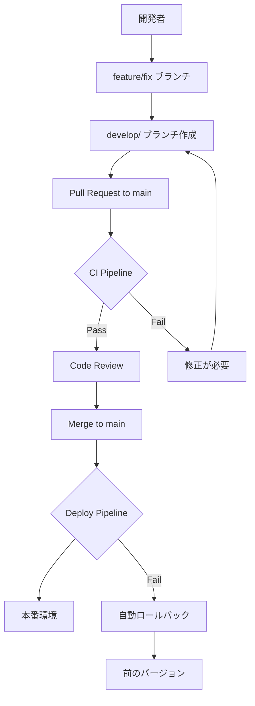

# CI/CD完全ガイド

## 📋 目次

1. [概要](#概要)
2. [ブランチ戦略とCI/CD](#ブランチ戦略とcicd)
3. [CI パイプライン詳細](#ci-パイプライン詳細)
4. [デプロイパイプライン詳細](#デプロイパイプライン詳細)
5. [ブランチ保護設定](#ブランチ保護設定)
6. [セットアップ手順](#セットアップ手順)
7. [実際の使い方](#実際の使い方)
8. [トラブルシューティング](#トラブルシューティング)
9. [ベストプラクティス](#ベストプラクティス)

---

## 概要

このプロジェクトでは、**安全で効率的な開発プロセス**を実現するために、包括的なCI/CDシステムを導入しています。

### 🎯 目的

- **品質保証**: コードのビルド・Lint・型チェック・セキュリティスキャンを自動実行
- **セキュリティ**: 脆弱性の早期発見と対処
- **安全なデプロイ**: main ブランチから本番環境への自動デプロイ
- **開発効率**: 手動作業の削減と迅速なフィードバック
- **柔軟性**: テストコードの有無に関わらず、適切な品質チェックを実行

### 🏗️ アーキテクチャ概要



---

## ブランチ戦略とCI/CD

### 🌳 ブランチ構成

```
📦 Repository
├── 🔒 main (本番環境) - 直接push禁止
│   ↑ develop/feature-name からのみマージ可能
│   └── 🤖 自動デプロイ → 本番環境
│
├── 🔧 develop/feature-name (開発ブランチ)
│   ├── ✅ CI実行 (フル)
│   └── 👥 コードレビュー必須
│
├── 🚀 feature/feature-name (機能開発)
├── 🐛 fix/bug-name (バグ修正)
└── 🔥 hotfix/urgent-fix (緊急修正)
```

### 🚫 制約ルール

| ブランチ | 直接Push | PR作成 | CIチェック | レビュー必須 |
|---------|---------|---------|-----------|------------|
| `main` | ❌ 禁止 | `develop/`のみ | ✅ 必須 | ✅ 必須 |
| `develop/` | ✅ 可能 | ✅ 可能 | ✅ 必須 | ✅ 必須 |
| `feature/` | ✅ 可能 | ✅ 可能 | ✅ 自動 | 任意 |

---

## CI パイプライン詳細

### 📊 実行タイミング

```yaml
# Pull Request時
triggers:
  - opened      # PR作成時
  - synchronize # 新しいコミット時  
  - reopened    # PR再オープン時

# Push時
triggers:
  - develop/**  # develop系ブランチ
  - feature/**  # feature系ブランチ
  - fix/**      # fix系ブランチ
  - hotfix/**   # hotfix系ブランチ
```

### 🏗️ パイプライン構成

#### 1️⃣ **ブランチ保護チェック** (branch-protection)

```bash
実行条件: Pull Request to main
実行時間: ~30秒
```

**チェック内容:**
- ブランチ名が `develop/` で始まるかチェック
- 命名規則の検証

**成功例:**
```
✅ develop/user-authentication
✅ develop/fix-login-bug  
✅ develop/add-payment-system
```

**失敗例:**
```
❌ feature/user-auth      → develop/user-auth に変更が必要
❌ bugfix/login-issue     → develop/fix-login-issue に変更が必要
❌ user-authentication   → develop/user-authentication に変更が必要
```

#### 2️⃣ **変更ファイル検出** (detect-changes)

```bash
実行条件: 全てのPull Request
実行時間: ~15秒
```

**検出パターン:**

| カテゴリ | ファイルパターン | 影響するジョブ |
|---------|-----------------|--------------|
| **Backend** | `backend/**`, `api/**`, `database/**` | test-backend, integration-test |
| **Frontend** | `frontend/**`, `package*.json` | test-frontend, integration-test |
| **Infrastructure** | `infrastructure/**`, `docker-compose.yml` | integration-test |

**最適化効果:**
```
フロントエンドのみ変更 → バックエンドテストをスキップ
バックエンドのみ変更 → フロントエンドテストをスキップ
```

#### 3️⃣ **バックエンドテスト** (test-backend)

```bash
実行条件: backend/**, api/**, database/** の変更時
実行時間: ~5-10分
```

**テスト環境:**
```yaml
サービス:
  - MySQL 8.0 (ポート: 3306)
  - Redis 7-alpine (ポート: 6379)
```

**実行内容:**
1. **Go環境セットアップ** (Go 1.21)
2. **依存関係キャッシュ** (Go modules)
3. **依存関係インストール** (`go mod download`)
4. **テストファイル検出と実行** (テストファイルがある場合のみ)
   ```bash
   # テストファイルが存在する場合
   if find . -name "*_test.go" -type f | grep -q .; then
     go test -v -race -coverprofile=coverage.out ./...
     go tool cover -html=coverage.out -o coverage.html
   else
     echo "⏭️ No test files found, skipping tests..."
   fi
   ```
5. **カバレッジアップロード** (テストが実行された場合のみ)
6. **Linting実行**
   ```bash
   golangci-lint run --timeout=5m
   ```

**品質基準:**
- ✅ Lintエラー: 0個（必須）
- ✅ ビルド: 成功（必須）
- ✅ テストカバレッジ: テストファイルがある場合のみ（オプション）
- ✅ レースコンディション: テスト実行時のみチェック（オプション）

#### 4️⃣ **フロントエンドテスト** (test-frontend)

```bash
実行条件: frontend/**, package*.json の変更時
実行時間: ~3-8分
```

**実行内容:**
1. **Node.js環境セットアップ** (Node.js 18)
2. **依存関係キャッシュ** (npm cache)
3. **依存関係インストール**
   ```bash
   npm ci --prefer-offline --no-audit
   ```
4. **ESLint実行**
   ```bash
   npm run lint
   ```
5. **TypeScript型チェック**
   ```bash
   npm run type-check
   ```
6. **テストファイル検出と実行** (テストファイルがある場合のみ)
   ```bash
   # テストファイルが存在する場合
   if find . -name "*.test.*" -o -name "*.spec.*" | grep -q .; then
     npm run test -- --coverage --watchAll=false
   else
     echo "⏭️ No test files found, skipping tests..."
   fi
   ```
7. **ビルド実行**
   ```bash
   npm run build
   ```
8. **ビルド成果物アップロード** (7日間保持)

**品質基準:**
- ✅ ESLintエラー: 0個（必須）
- ✅ TypeScriptエラー: 0個（必須）
- ✅ ビルド: 成功（必須）
- ✅ テスト: テストファイルがある場合のみ実行（オプション）

#### 5️⃣ **セキュリティスキャン** (security-scan)

```bash
実行条件: 全てのPull Request
実行時間: ~2-5分
```

**スキャン内容:**
1. **Trivy脆弱性スキャン**
   - ファイルシステム全体をスキャン
   - 依存関係の脆弱性チェック
   - SARIF形式でレポート生成

2. **結果のアップロード**
   - GitHub Security tabに結果表示
   - 重要度別の脆弱性リスト

**セキュリティレベル:**
```
🔴 Critical: 即座に修正必要
🟠 High: 優先的に修正
🟡 Medium: 計画的に修正
🔵 Low: 適宜修正
```

#### 6️⃣ **統合テスト** (integration-test)

```bash
実行条件: backend/** または frontend/** の変更時
実行時間: ~10-15分
```

**テスト環境:**
```yaml
環境構成:
  - MySQL: app_template_test データベース
  - Redis: キャッシュサーバー
  - Backend: Go APIサーバー (ポート: 8080)
  - Frontend: Next.js アプリ (ポート: 3000)
```

**実行フロー:**
1. **環境変数設定**
   ```bash
   DB_HOST=mysql
   DB_USER=app_user
   DB_PASSWORD=app_password
   JWT_SECRET=test_jwt_secret_key_for_ci
   ```

2. **Docker Compose起動**
   ```bash
   docker-compose up -d --build
   ```

3. **サービス待機**
   ```bash
   # APIサーバーの起動を待機
   timeout 60 bash -c 'until curl -f http://localhost:8080/health; do sleep 2; done'
   
   # フロントエンドの起動を待機
   timeout 60 bash -c 'until curl -f http://localhost:3000; do sleep 2; done'
   ```

4. **基本接続テスト**
   ```bash
   # 基本的な接続確認（テスト代替）
   curl -f http://localhost:8080/health || echo "⚠️ Backend health check failed"
   curl -f http://localhost:3000 || echo "⚠️ Frontend health check failed"
   
   echo "✅ Integration test completed - services are accessible"
   ```

5. **環境クリーンアップ**
   ```bash
   docker-compose down -v
   ```

#### 7️⃣ **PR要約コメント** (pr-summary)

```bash
実行条件: Pull Request時（最後に実行）
実行時間: ~30秒
```

**コメント例:**
```markdown
## 🚀 CI Pipeline Results

| Check | Status |
|-------|--------|
| Branch Protection | ✅ Passed |
| Backend Tests | ✅ success |
| Frontend Tests | ⏭️ skipped |
| Security Scan | ✅ success |
| Integration Tests | ✅ success |

**Branch:** `develop/user-authentication` → `main`
**Commit:** abc123def456
```

---

## デプロイパイプライン詳細

### 🚀 実行タイミング

```yaml
triggers:
  push:
    branches: [main]    # mainブランチへのマージ時
  workflow_dispatch:    # 手動実行
```

### 🏗️ デプロイフロー

#### 1️⃣ **デプロイ前最終チェック** (pre-deploy-checks)

```bash
実行時間: ~1-2分
```

**チェック内容:**
1. **マージ元ブランチ確認**
   ```bash
   # 最新コミットがdevelop/からのマージかチェック
   LAST_COMMIT_MESSAGE=$(git log -1 --pretty=format:"%s")
   if [[ "$LAST_COMMIT_MESSAGE" =~ ^Merge\ pull\ request.*develop/.* ]]; then
     echo "✅ Deploy from develop/ branch merge confirmed"
   fi
   ```

2. **破壊的変更の検出**
   ```bash
   # APIスキーマの変更をチェック
   if git diff HEAD~1 --name-only | grep -E "(api/|openapi\.yml)"; then
     echo "⚠️ API changes detected - ensure backward compatibility"
   fi
   ```

#### 2️⃣ **本番ビルド** (build-and-test)

```bash
実行時間: ~5-10分
```

**ビルド内容:**
1. **フロントエンド本番ビルド**
   ```bash
   NODE_ENV=production npm run build
   ```

2. **バックエンド本番ビルド**
   ```bash
   CGO_ENABLED=0 GOOS=linux go build -a -installsuffix cgo -o main ./cmd/main.go
   ```

3. **成果物アップロード** (30日間保持)

#### 3️⃣ **セキュリティチェック** (security-check)

```bash
実行時間: ~3-5分
```

**チェック内容:**
1. **依存関係脆弱性スキャン**
   ```bash
   # Go dependencies
   govulncheck ./...
   
   # Node.js dependencies  
   npm audit --audit-level moderate
   ```

2. **シークレットスキャン**
   ```bash
   # TruffleHogによるシークレット検出
   trufflehog ./
   ```

#### 4️⃣ **AWS デプロイ** (deploy)

```bash
実行時間: ~10-20分
```

**デプロイフロー:**

1. **AWS認証**
   ```bash
   aws-actions/configure-aws-credentials@v4
   ```

2. **ECRログイン**
   ```bash
   aws ecr get-login-password | docker login --username AWS --password-stdin
   ```

3. **Dockerイメージビルド・プッシュ**
   ```bash
   # Backend image
   docker build -t ECR_REGISTRY/app-template-backend:SHA .
   docker push ECR_REGISTRY/app-template-backend:SHA
   
   # Frontend image
   docker build -t ECR_REGISTRY/app-template-frontend:SHA .
   docker push ECR_REGISTRY/app-template-frontend:SHA
   ```

4. **ECSサービス更新**
   ```bash
   aws ecs update-service \
     --cluster ECS_CLUSTER_NAME \
     --service ECS_SERVICE_NAME \
     --force-new-deployment
   ```

5. **デプロイ完了待機**
   ```bash
   aws ecs wait services-stable \
     --cluster ECS_CLUSTER_NAME \
     --services ECS_SERVICE_NAME
   ```

#### 5️⃣ **スモークテスト** (smoke-test)

```bash
実行時間: ~2-3分
```

**テスト内容:**
```bash
# ヘルスチェック
curl -f "$PRODUCTION_URL/health" || exit 1

# 基本エンドポイント
curl -f "$PRODUCTION_URL" || exit 1

# APIエンドポイント
curl -f "$PRODUCTION_URL/api/v1/health" || exit 1
```

#### 6️⃣ **通知・記録** (notification)

```bash
実行時間: ~30秒
```

**通知内容:**
```json
{
  "text": "🚀 Production deployment completed\n**Commit:** abc123\n**Version:** 20240101-1200\n**Status:** Success"
}
```

**送信先:**
- Slack (#deployments)
- メール通知 (オプション)

#### 🔄 **自動ロールバック** (rollback)

```bash
実行条件: デプロイ失敗時
実行時間: ~5-10分
```

**ロールバック内容:**
```bash
# 前のタスク定義に戻す
aws ecs update-service \
  --cluster ECS_CLUSTER_NAME \
  --service ECS_SERVICE_NAME \
  --task-definition PREVIOUS_TASK_DEFINITION

# Slack通知
curl -X POST -H 'Content-type: application/json' \
  --data '{"text":"⚠️ Emergency rollback executed"}' \
  SLACK_WEBHOOK_URL
```

---

## ブランチ保護設定

### 🔒 mainブランチ保護

```yaml
Protection Rules:
  required_status_checks:
    strict: true                    # 最新の状態必須
    contexts:                       # 必須チェック
      - branch-protection
      - test-backend  
      - test-frontend
      - security-scan
      - integration-test
      
  required_pull_request_reviews:
    dismiss_stale_reviews: true     # 古いレビューを無効化
    require_code_owner_reviews: true # CODEOWNERSのレビュー必須
    required_approving_review_count: 1 # 最低1人の承認
    
  restrictions: null                # 誰でもPR作成可能
  allow_force_pushes: false        # フォースプッシュ禁止
  allow_deletions: false           # ブランチ削除禁止
  required_conversation_resolution: true # 会話解決必須
```

### 🔧 developブランチ保護

```yaml
Protection Rules:
  required_status_checks:
    contexts:
      - test-backend
      - test-frontend  
      - security-scan
      
  required_pull_request_reviews:
    required_approving_review_count: 1
    require_code_owner_reviews: false
```

### 👥 CODEOWNERSファイル

```gitignore
# デフォルト（全ファイル）
* @matthewyuh246

# バックエンド
/backend/ @matthewyuh246
/api/ @matthewyuh246  
/database/ @matthewyuh246

# フロントエンド
/frontend/ @matthewyuh246

# インフラ・CI/CD
/infrastructure/ @matthewyuh246
/.github/ @matthewyuh246
/docker-compose.yml @matthewyuh246

# ドキュメント
/README.md @matthewyuh246
/docs/ @matthewyuh246
```

---

## セットアップ手順

### 1️⃣ **GitHub Secrets設定**

**AWS関連 (必須):**
```
AWS_ACCESS_KEY_ID         = AKIA...
AWS_SECRET_ACCESS_KEY     = abc123...
AWS_REGION               = ap-northeast-1
ECR_REGISTRY            = 123456789.dkr.ecr.ap-northeast-1.amazonaws.com
ECS_CLUSTER_NAME        = app-template-cluster
ECS_SERVICE_NAME        = app-template-service
PRODUCTION_URL          = https://yourdomain.com
```

**通知関連 (オプション):**
```
SLACK_WEBHOOK_URL       = https://hooks.slack.com/services/...
```

### 2️⃣ **ブランチ保護設定**

**自動設定:**
```bash
# GitHubのActionsタブで実行
Actions > Setup Branch Protection > Run workflow
```

**手動設定:**
1. GitHub Repository Settings
2. Branches → Add rule
3. Branch name pattern: `main`
4. 必要な設定を有効化

### 3️⃣ **Dependabot設定**

```yaml
# .github/dependabot.yml は自動で動作
# 毎週月曜日 9:00 (JST) に依存関係チェック
# develop ブランチに PR作成
```

### 4️⃣ **初回テスト**

```bash
# 1. developブランチ作成
git checkout -b develop/test-ci-setup

# 2. 小さな変更を追加
echo "# CI Test" >> README.md
git add README.md
git commit -m "test: CI setup test"
git push origin develop/test-ci-setup

# 3. Pull Request作成
# mainブランチへのPRを作成してCIをテスト
```

---

## 実際の使い方

### 💡 日常の開発フロー

#### **ステップ1: ブランチ作成**
```bash
# 最新のmainから開始
git checkout main
git pull origin main

# 機能に応じてブランチ作成
git checkout -b develop/user-profile-edit
```

#### **ステップ2: 開発作業**
```bash
# コード作成
code frontend/pages/profile.tsx

# ローカルテスト
make test
make lint

# コミット
git add .
git commit -m "feat: ユーザープロフィール編集機能を追加"
```

#### **ステップ3: プッシュとPR作成**
```bash
# プッシュ
git push origin develop/user-profile-edit

# GitHub でPR作成
# Title: feat: ユーザープロフィール編集機能
# Base: main ← Compare: develop/user-profile-edit
```

#### **ステップ4: CI確認**
```bash
# CIが自動実行される
✅ branch-protection    - ブランチ名チェック通過
⏳ detect-changes      - フロントエンド変更検出
⏳ test-frontend       - フロントエンドテスト実行中
⏭️ test-backend       - スキップ（変更なし）
⏳ security-scan       - セキュリティスキャン実行中
⏳ integration-test    - 統合テスト実行中
```

#### **ステップ5: レビューと修正**
```bash
# レビューコメントがあった場合
git add .
git commit -m "fix: レビューコメント対応"
git push origin develop/user-profile-edit

# CI再実行
```

#### **ステップ6: マージとデプロイ**
```bash
# レビュー承認後、マージ
# 自動でデプロイパイプライン実行
✅ pre-deploy-checks   - デプロイ前チェック通過
⏳ build-and-test     - 本番ビルド実行中
⏳ security-check     - セキュリティチェック実行中
⏳ deploy             - AWS デプロイ実行中
⏳ smoke-test         - スモークテスト実行中
✅ notification       - デプロイ完了通知
```

### 🛠️ 特殊なケース

#### **緊急修正 (hotfix)**
```bash
# hotfixブランチ作成
git checkout main
git checkout -b hotfix/security-vulnerability

# 修正作業
# ... コード修正 ...

# develop系ブランチとして提出
git checkout -b develop/hotfix-security-vulnerability
git cherry-pick <hotfix-commit>
git push origin develop/hotfix-security-vulnerability
```

#### **依存関係更新**
```bash
# Dependabot が自動でPR作成
# develop ブランチに週次で送信される

# PR確認とマージ
1. 変更内容確認
2. CIチェック確認  
3. テスト結果確認
4. マージ実行
```

#### **CI失敗時の対応**

**ビルド・Lint失敗:**
```bash
# ローカルで再現
make build
make lint

# 修正
git add .
git commit -m "fix: ビルド・Lint修正"
git push origin develop/your-branch
```

**テスト失敗（テストファイルがある場合）:**
```bash
# ローカルで再現
make test

# 修正
git add .
git commit -m "fix: テスト修正"
git push origin develop/your-branch
```

**Lint失敗:**
```bash
# 自動修正
make lint-fix

# 手動修正が必要な場合
git add .
git commit -m "style: lint修正"
git push origin develop/your-branch
```

**セキュリティ警告:**
```bash
# 依存関係更新
npm audit fix
go mod tidy

git add .
git commit -m "chore: セキュリティ修正"
git push origin develop/your-branch
```

---

## トラブルシューティング

### 🚨 よくあるエラー

#### **1. ブランチ名エラー**

**エラー:**
```
❌ Error: Pull requests to main branch must come from 'develop/' branches
Current branch: feature/user-auth
Expected pattern: develop/feature-name
```

**解決策:**
```bash
# 新しいdevelop系ブランチ作成
git checkout -b develop/user-auth

# コミットをコピー
git cherry-pick <commit-hash>

# プッシュして新しいPR作成
git push origin develop/user-auth
```

#### **2. ビルド失敗**

**エラー:**
```
❌ Build failed: compilation error
  ● Type error: Property 'username' does not exist on type 'User'
```

**解決策:**
```bash
# ローカルで環境構築
make setup
make dev

# ビルド実行
make build

# 型チェック実行
npm run type-check  # フロントエンド
go build ./...      # バックエンド

# 修正後
git add .
git commit -m "fix: 型エラー修正"
git push origin develop/your-branch
```

#### **3. 依存関係エラー**

**エラー:**
```
❌ npm install failed
npm ERR! peer dep missing: react@^18.0.0
```

**解決策:**
```bash
# 依存関係修正
cd frontend
npm install react@^18.0.0

# package-lock.json更新
git add package*.json
git commit -m "chore: 依存関係更新"
git push origin develop/your-branch
```

#### **4. Docker ビルドエラー**

**エラー:**
```
❌ Docker build failed
Step 5/10 : RUN npm ci
npm ERR! Cannot read property 'match' of undefined
```

**解決策:**
```bash
# ローカルでビルドテスト
docker build -t test-frontend -f frontend/Dockerfile .

# キャッシュクリア
docker builder prune

# Dockerfileの修正
# 再プッシュ
```

#### **5. デプロイエラー**

**エラー:**
```
❌ ECS service update failed
ServiceNotFoundException: Service not found
```

**解決策:**
```bash
# AWS 設定確認
aws ecs describe-services --cluster CLUSTER_NAME --services SERVICE_NAME

# GitHub Secrets確認
# ECS_CLUSTER_NAME, ECS_SERVICE_NAME が正しいか確認

# 手動ロールバック（必要に応じて）
aws ecs update-service --cluster CLUSTER --service SERVICE --task-definition PREVIOUS_TASK_DEF
```

### 🔧 デバッグ方法

#### **CIログの確認**
```bash
# GitHub Actions
1. Repository → Actions
2. 失敗したワークフロー選択
3. 失敗したJob選択
4. ログ詳細確認
```

#### **ローカル環境での再現**
```bash
# 環境変数設定
cp env.example .env

# CI環境に近い状態で実行
docker-compose -f docker-compose.yml up -d

# テスト実行
make test-integration
```

#### **セキュリティスキャン詳細**
```bash
# ローカルでTrivyスキャン
docker run --rm -v "$(pwd)":/workspace aquasec/trivy fs /workspace

# 結果はGitHub Security tabでも確認可能
```

---

## ベストプラクティス

### ✅ 推奨事項

#### **ブランチ命名**
```bash
✅ Good:
develop/user-authentication
develop/fix-login-bug
develop/add-payment-integration

❌ Bad:
user-authentication
feature/user-auth
bugfix/login
```

#### **コミットメッセージ**
```bash
✅ Good:
feat: ユーザー認証機能を追加
fix: ログイン時のリダイレクト問題を修正
docs: API仕様書を更新

❌ Bad:
update
fix bug
add feature
```

#### **PR作成**
```bash
✅ Good:
- 小さな単位でPR作成
- PRテンプレートを活用
- スクリーンショット添付（UI変更時）
- テスト方法を記載

❌ Bad:
- 巨大な変更を一つのPRに
- 説明不足
- テスト手順不明
```

#### **コードレビュー**
```bash
✅ Good:
- 建設的なフィードバック
- コードとデザインの両方確認
- セキュリティ観点の確認
- 24-48時間以内にレビュー

❌ Bad:
- 単なる文法指摘のみ
- 長期間のレビュー放置
- 不十分な確認
```

### 🚀 パフォーマンス最適化

#### **CI実行時間短縮**
```yaml
# 変更検出による最適化
- バックエンドのみ変更 → フロントエンドテストスキップ
- フロントエンドのみ変更 → バックエンドテストスキップ

# キャッシュ活用
- Go modules キャッシュ: 7日間
- npm cache: 7日間  
- Docker layers キャッシュ: 3日間

# 並列実行
- 各テストジョブは独立して並列実行
- セキュリティスキャンも並列実行
```

#### **リソース使用量最適化**
```yaml
# テストデータベース
- MySQL: 最小限の設定
- Redis: alpine版使用

# ビルド最適化
- multi-stage build
- .dockerignore活用
- 不要ファイル除外
```

### 🔐 セキュリティベストプラクティス

#### **機密情報管理**
```bash
✅ Good:
- GitHub Secrets使用
- 環境変数で設定値管理
- .env ファイルは .gitignore

❌ Bad:
- コードにAPIキー埋め込み
- パスワードをコミット
- 機密情報をログ出力
```

#### **依存関係管理**
```bash
# 定期更新
- Dependabot週次実行
- セキュリティパッチ優先適用
- 互換性確認

# 脆弱性監視
- Trivy スキャン
- npm audit
- go mod security check
```

### 📊 監視・メトリクス

#### **CI/CD メトリクス**
```bash
追跡指標:
- ビルド成功率: >95%
- 平均ビルド時間: <15分
- デプロイ頻度: 週数回
- リードタイム: <2日
- 復旧時間: <30分
```

#### **品質メトリクス**
```bash
コード品質:
- ビルド成功率: 100%（必須）
- Lint エラー: 0個（必須）
- TypeScript型エラー: 0個（必須）
- セキュリティ脆弱性: 0個（必須）
- テストカバレッジ: テストファイルがある場合のみ（オプション）
```

### 🚀 テストなし開発でのベストプラクティス

#### **品質担保の代替手段**
```bash
テストコードの代わりに以下で品質を担保:

✅ 静的解析:
- ESLint（フロントエンド）
- golangci-lint（バックエンド）
- TypeScript型チェック

✅ ビルド検証:
- フロントエンド本番ビルド
- バックエンドコンパイル
- 依存関係整合性チェック

✅ セキュリティスキャン:
- Trivy脆弱性スキャン
- 依存関係セキュリティチェック

✅ 統合確認:
- Docker Compose環境での起動確認
- サービス間通信の基本テスト
- ヘルスチェックエンドポイント確認
```

#### **推奨開発フロー**
```bash
1. **ローカル確認**:
   make build    # ビルドエラーがないか
   make lint     # Lintエラーがないか
   make dev      # 実際に動作するか

2. **段階的開発**:
   - 小さな変更単位でコミット
   - 頻繁にビルド確認
   - 早期のPR作成でCI確認

3. **手動テスト重視**:
   - ブラウザでの動作確認
   - API エンドポイントの動作確認
   - 異常系のケース確認
```

#### **将来のテスト導入計画**
```bash
Phase 1: 基本品質確保（現在）
- Lint + 型チェック + ビルド確認
- セキュリティスキャン
- 基本統合テスト

Phase 2: 重要機能のテスト追加（将来）
- 認証機能のテスト
- API エンドポイントのテスト
- 重要画面のE2Eテスト

Phase 3: 包括的テスト（将来）
- 全機能のユニットテスト
- 統合テスト拡充
- パフォーマンステスト
```

### 🎯 継続的改善

#### **定期レビュー**
```bash
月次レビュー:
- CI/CD パイプライン効率化
- ビルド・Lint設定見直し
- セキュリティ設定見直し
- 開発者フィードバック収集

四半期レビュー:
- ツール・技術選定見直し
- プロセス改善
- 品質基準更新
- テスト導入検討
```

#### **自動化拡張**
```bash
将来の改善案:
- E2Eテスト自動化
- パフォーマンステスト統合
- 自動ロードテスト
- セキュリティペネトレーションテスト
```

---

## 📞 サポート・問い合わせ

### 🆘 困った時の連絡先

**技術的な質問:**
- GitHub Issues: バグ報告・機能要望
- GitHub Discussions: 質問・相談
- Slack #development: 日常的な質問

**緊急時の対応:**
- Slack #alerts: 本番環境の問題
- 直接連絡: 重大な障害時

### 📚 関連ドキュメント

- [開発ガイド](./DEVELOPMENT.md): 日常的な開発フロー
- [API仕様書](http://localhost:8081): Swagger UI
- [プロジェクト概要](../README.md): プロジェクト全体像

---

**最終更新日:** 2024年1月
**バージョン:** 1.0
**作成者:** Development Team